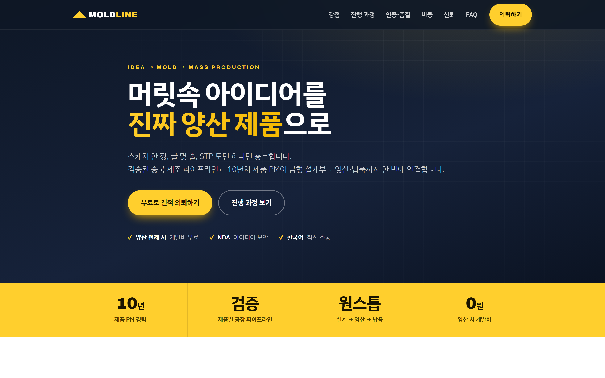
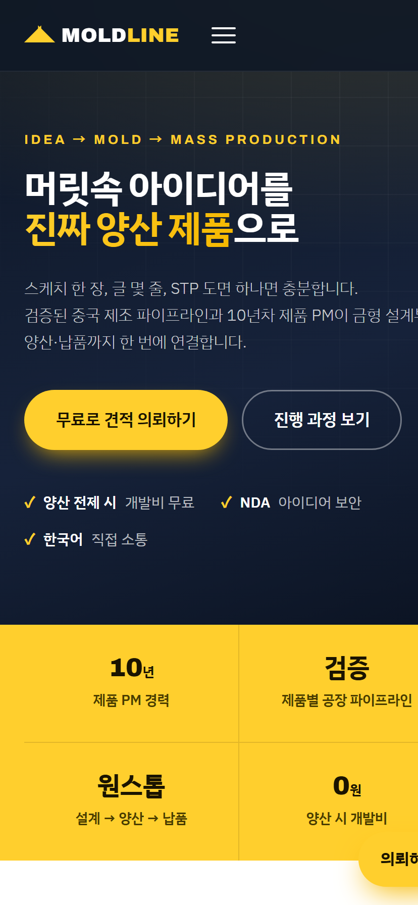

# MOLDLINE

아이디어를 중국 제조 양산 제품으로 연결하는 웹사이트 + 의뢰 접수 백엔드.

## 미리보기

| 데스크톱 | 모바일 |
|:---:|:---:|
|  |  |

## 다운로드 & 실행 (처음이라면 여기부터)

> **준비물:** [Node.js LTS](https://nodejs.org) 설치 (18 버전 이상)
> macOS는 [Homebrew](https://brew.sh)로 `brew install node` 해도 됩니다. 설치 확인: `node -v`

### 1. 코드 받기

- **방법 A — Git:**
  ```bash
  git clone https://github.com/JaydenWork/moldline.git
  cd moldline
  ```
- **방법 B — ZIP:** GitHub 저장소 페이지 → 초록색 **Code** 버튼 → **Download ZIP** → 압축 풀기

### 2. 설치 & 실행

**Windows:**
```bash
npm install                 # 의존성 설치 (최초 1회)
copy .env.example .env      # 설정 파일 생성
npm start                   # 서버 실행
```

**macOS / Linux:**
```bash
npm install                 # 의존성 설치 (최초 1회)
cp .env.example .env        # 설정 파일 생성
npm start                   # 서버 실행in
```

→ 브라우저에서 **http://localhost:3000** 접속 (관리자 페이지: **/admin**)

> `.env`는 받는 사람이 직접 채워야 합니다(디스코드 웹훅·관리자 비밀번호 등).
> **비워둬도 화면·폼 제출·파일 저장은 정상 동작**하며, 알림 기능만 비활성화됩니다.

### 화면만 빠르게 보고 싶다면

`index.html`을 더블클릭하면 디자인은 바로 보입니다. 단, **폼 제출·관리자·알림 등 기능은 서버(`npm start`)가 있어야** 동작합니다.

## 구성

| 파일 | 역할 |
|------|------|
| `index.html` / `styles.css` / `script.js` | 반응형 프론트엔드 (랜딩 + 의뢰 폼) |
| `server.js` | Express 백엔드 — 정적 서빙, 대용량 파일 업로드, 이메일 알림 |
| `.env.example` | 환경변수 템플릿 (복사해서 `.env`로 사용) |
| `uploads/` | 업로드된 도면·이미지 저장 폴더 (자동 생성, git 제외) |

개발 중 자동 재시작: `npm run dev` (Node 18+ 의 `--watch`).

## 이메일 설정 (Gmail 예시)

1. Google 계정 → 보안 → **2단계 인증** 켜기
2. **앱 비밀번호** 발급 (메일용)
3. `.env`에 입력:
   ```
   SMTP_HOST=smtp.gmail.com
   SMTP_PORT=587
   SMTP_SECURE=false
   SMTP_USER=your-account@gmail.com
   SMTP_PASS=발급받은-16자리-앱비밀번호
   MAIL_FROM="MOLDLINE <your-account@gmail.com>"
   MAIL_TO=admin@moldline.kr
   ```

> 회사 메일/네이버웍스/SES 등 다른 SMTP도 동일하게 `SMTP_*` 값만 바꾸면 됩니다.
> 465 포트(SSL)를 쓰면 `SMTP_SECURE=true`로 설정하세요.

## 동작 방식

- 고객이 폼 제출 → `POST /api/submit`
- 파일은 **디스크에 스트리밍 저장**(메모리 사용 안 함) → `uploads/<접수번호>/`
- 알림 (서로 독립 — 일부 실패해도 접수는 성공):
  - **이메일**: 관리자에게 의뢰 내용 + 파일 첨부(`EMAIL_ATTACH_LIMIT_MB` 이하), 고객에게 접수 확인 자동회신
  - **디스코드**: 채널에 임베드 메시지 + 첨부(`DISCORD_ATTACH_LIMIT_MB` 이하). 한도 초과 파일은 목록으로만 안내
- 한도를 넘는 대용량 STP는 첨부 대신 **서버 보관 경로** 안내 (메일/디스코드 용량 초과 방지)
- 각 의뢰는 `uploads/<접수번호>/_submission.json`에도 기록 (알림 실패 시 백업)

## 디스코드 알림 설정

1. 디스코드 채널 → **채널 편집(⚙️) → 연동 → 웹훅 → 새 웹훅**
2. 이름/아이콘 지정 후 **"웹후크 URL 복사"**
3. `.env`에 입력:
   ```
   DISCORD_WEBHOOK_URL=https://discord.com/api/webhooks/...........
   DISCORD_ATTACH_LIMIT_MB=8      # 디스코드 무료 업로드 한도
   DISCORD_MENTION=@here          # (선택) 알림 시 멘션. 비우면 멘션 없음
   ```
4. 서버 재시작 → 문의가 오면 해당 채널에 의뢰 내역과 첨부가 전송됩니다.

> 이메일과 디스코드는 둘 다 선택입니다. 원하는 것만 `.env`에 설정하면 됩니다.

## 업로드 제한

- 개당 최대 **50MB**, 최대 **10개**, 의뢰 1건당 **총합 60MB**(`MAX_TOTAL_SIZE_MB`)
- 허용 확장자: 이미지(jpg/png/webp…), pdf/doc/txt, 도면(stp/step/stl/igs/iges/x_t/sldprt/3dm/obj), 압축(zip/rar/7z)
- 한도는 `server.js` 상단 상수와 `multer fileFilter`에서 조정 (nginx 사용 시 `client_max_body_size`도 함께 조정)

## 배포 메모

- 운영에서는 **리버스 프록시(nginx)** 뒤에 두고 HTTPS 적용 권장
- nginx 사용 시 `client_max_body_size 60m;` 같은 업로드 한도 설정 필요
- `uploads/`는 정기 백업 또는 S3 등 외부 스토리지 연동 검토
- 프로세스 관리는 `pm2` 등 사용 권장
